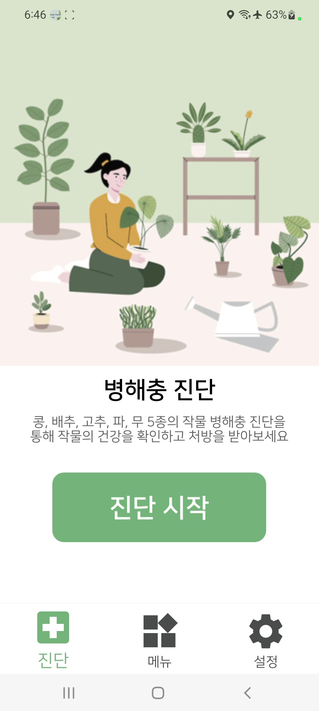
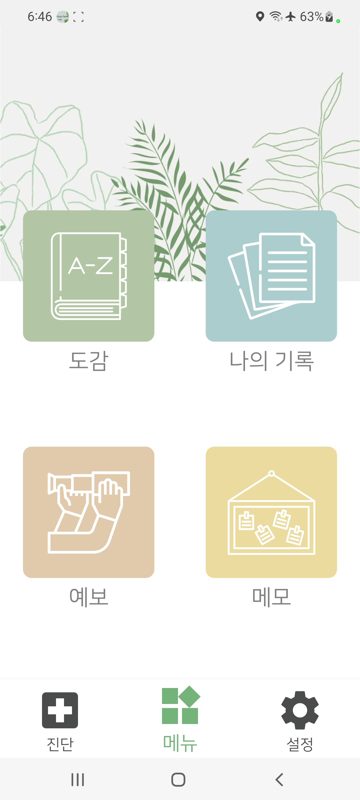
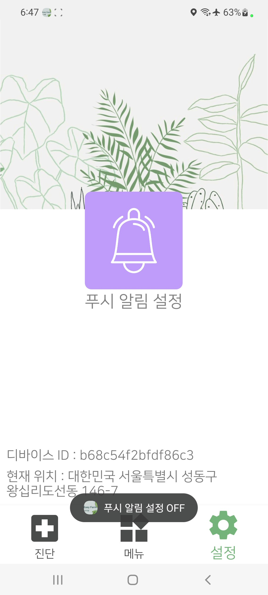
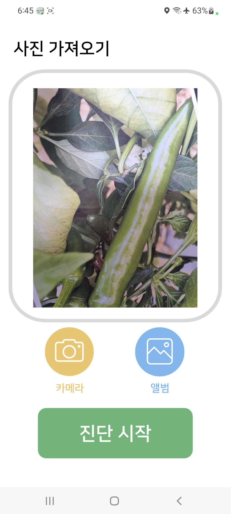
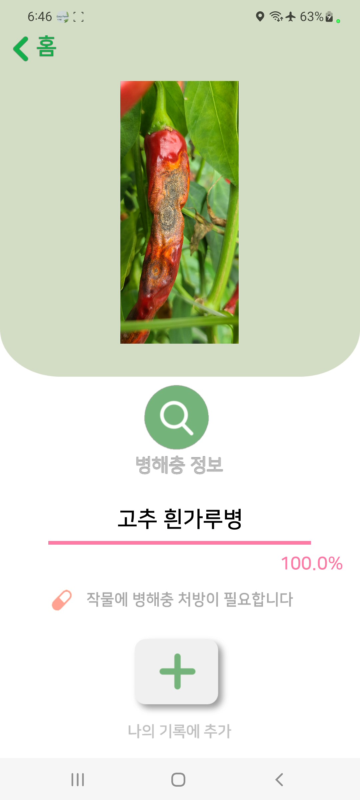
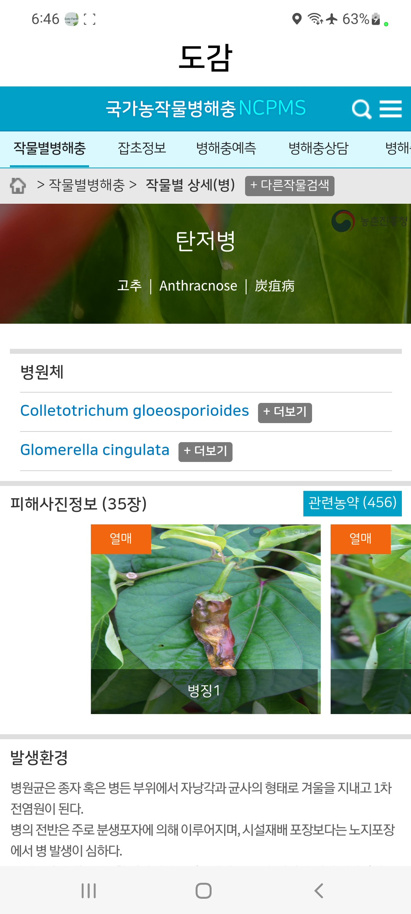
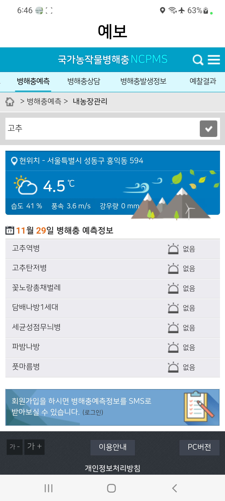
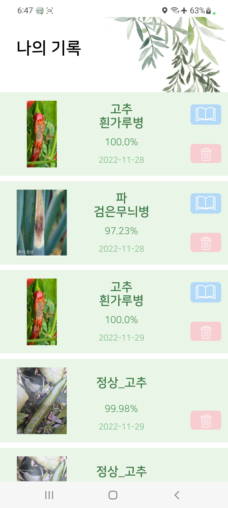
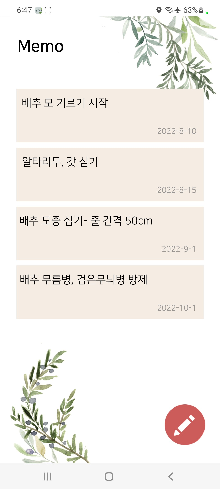
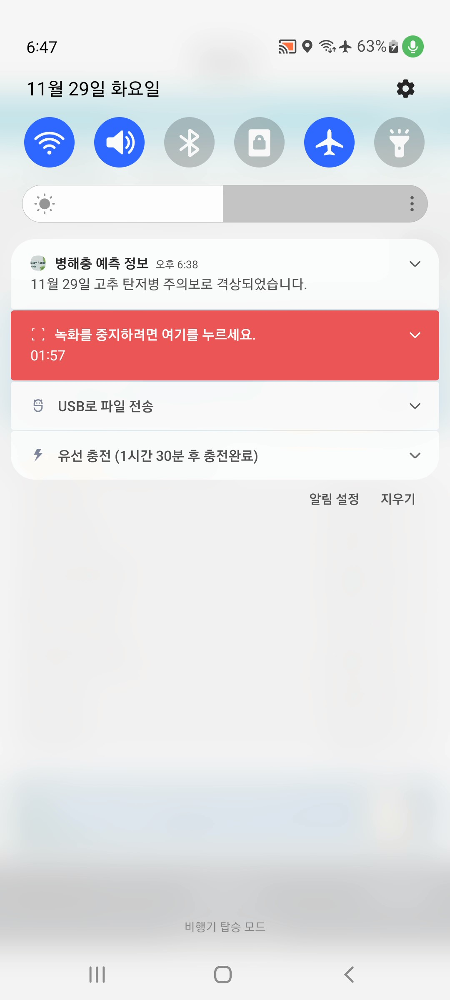

<h1 align="center" style='font-family: palatino Linotype'>EasyFarm</h1>
<h1 align="center" style='font-family: palatino Linotype'></h1>

# 주제
안드로이드와 인공지능을 이용한 노지 작물 병해충 검출 및 분류 플랫폼 구축 Capstone Design 프로젝트

## 기술 스택
Kotlin Retrofit Node.js Flask Firebase

## 기간
2022.09 ~ 2022.12

# [시연영상](https://jinyong3512.notion.site/sejong-university-easy-farm-b782bb8e366b468d84dfd94d0c1dc9b2?pvs=4)

## 프로젝트 진행
- 병해충을 판단해줄 전문 인력 부족으로 앱을 통한 간편한 진단 서비스
- 안드로이드 1명,서버 1명, 인공지능 2명 총 4명이 팀을 이루어 제작한 프로젝트

## 구현 목록
>1. [완료] 딥러닝을 이용한 병해충 판단 서비스
>2. [완료] 병해충 도감 서비스
>3. [완료] 병해충 기록 조회 서비스
>4. [완료] 예보를 통한 푸시 알림 서비스
>5. [완료] 메모장 서비스

## 구현 상세
- 전체적인 UI/UX 구현

    - 홈 화면
     
    
    
    - 메뉴 화면
     
    

    - 설정 화면
     
      

- 병해충 진단

    - 카메라 촬영 및 갤러리 이미지 서버로 업로드
     
    

    - 인공지능 진단 결과 서버로부터 받아서 출력
     
    

- 도감
    - 진단하지 않고도 병해충 관련 정보를 NCPMS에서 확인 가능
     
    

- 예보
    - 사용자의 GPS를 이용해 해당 지역 병해충 격상 단계 확인 가능
     
    

- 나의 기록
    - 로그인하는 번거로움 없이 안드로이드 디바이스 고유 ID를 이용하여 DB에서 기록을 가져와 보여 줌
     
    

- 메모장
    - 작물이나 병해충관련 메모 가능
     
    

- 푸시알림
    - 병해충 위험 관련 경보시 Firebase를 이용한 푸시 알림
     
    

